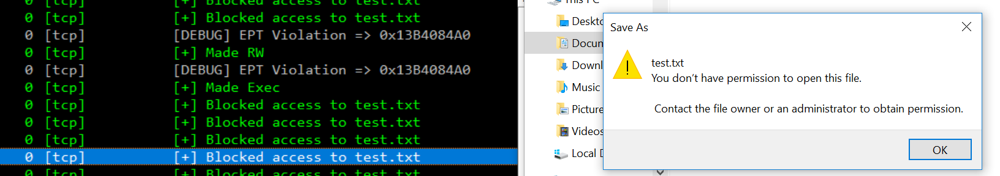

# Gbhv - Simple x64 Hypervisor Framework

**Gbhv** is a **simple, powerful 64-bit Windows-based VT-x Hypervisor proof of concept** written as an exercise to help learn how to develop and work with **Intel's VT-X** hardware virtualization technology.

This project is based on the original **Blue-Pill** hypervisor technique which subverts a running bare-metal OS, turning it into a virtualized system at the mercy of the hypervisor. When running above another operating system, a hypervisor is able to fully compromise the integrity of the system by intercepting any privileged operations and memory accesses the OS performs. For example, **Windows** will attempt to verify the integrity of the system against tampering from rootkits using a built-in protection called **PatchGuard**. To show the power of hardware assisted hypervisor technology, **Gbhv** takes advantage of the features of **VT-X** to stealthily hide code modifications from **PatchGuard**. With this technique, **Gbhv** can hook or modify any function or data of the running operating system without ever triggering security or integrity protections, making it an incredibly powerful tool in security research of operating systems.

## Example

**Gbhv** comes bundled with a precompiled driver ready to see in action (See `release/`). This driver provides a simple example of hooking the **NtCreateFile** API using **EPT Shadow Hooking** to block all usermode APIs which act on files that contain the substring 'test.txt'. The above image is an example of trying to create a file named test.txt, and the hypervisor intercepting and denying the process access. You will need to load it with the bundled `OSRLOADER.EXE` driver loader, or by using the `sc` command.

## Introduction to Intel VT-X/VMX

Intel's hardware assisted virtualization technology (originally **Vanderpool**, later renamed **VT-X/VMX**) is a set of processor features which add support for virtualized operating systems without the use of emulation. In the typical ring protection design of an x86 processor running a modern operating system, there are two main rings of operation: The **high privilege kernel-mode ring (Ring 0)** and **low privilege user-mode ring (Ring 3)**. Any code running in a higher ring has full privileged access to the code and data of rings below it. In old, non-hardware assisted virtualization, **Virtual Machine Monitors** (**VMM**) would execute at Ring 0 and attempt to intercept certain privileged actions using very slow binary translation mechanisms. With the invention of **VT-X**, a new mode of operation was introduced in hardware to provide the **VMMs** with a more privileged position over the guest operating systems that it manages. This new processor mode is named **VMX Root Mode**, and it executes at a mode more privileged than Ring 0, sometimes informally known as "Ring -1". In this higher privileged mode, the hypervisor uses its privilege to isolate memory and devices of multiple running operating systems into separate containerized environments while still achieving close to native processor execution speeds.

The central mechanism by which the processor enters and exits **VMX Root Mode** is through context switches known as **"VM Exits"** and **"VM Resumes"**. When a guest operating system performs a privileged operation that the VMM has been configured to intercept, the processor saves its current state and performs a **VM Exit** where it "exits" out of the guest operating system and into **Root Mode**. From the exit handler, the hypervisor can perform operations in its high privilege mode to handle the exit condition, and then "resume" back into the guest by restoring the processor context and continuing execution, returning the system back down to its original privilege level. This kind of processor switch will feel familiar for those who have a solid understanding of how interrupts are serviced in modern operating systems.

Not long after the release of **VMX** came a new feature called **Extended Page Tables** which significantly increased the functional power of hypervisors over the operating system. With **EPT**, hypervisors gained the ability to "virtualize" physical memory regions using a very similar kind of multilevel page tables that operating systems use to manage virtual memory. This allows a hypervisor to define and set memory protections for regions of memory at the physical memory level without any ability to interact from the guest operating system. In addition, **EPT** has a special ability to create "Execute-only" pages, or pages which can not be read or written to but can only be executed on the processor. This feature gave rise to a new kind of hooking mechanism, where a stealthy **VMM** can intercept attempts to execute a page and swaps in a modified page with new code. If something tries to verify the contents by reading to the code page, the **VMM** recieves a **VM Exit** due to the processor trying to read from an "Execute-only" page. This allows the **VMM** to quickly swap in a "clean" version of the page, making the reader believe that no code modification has taken place. This power over the underlying physical memory gives hypervisors total control of the code *and* data of the currently executing operating system.

## How Gbhv utilizes VMX

A particularly useful part of **VMX** operation is that, at its core, it is just a higher privileged processor mode. There is no requirement that this mode be used for executing a new operating system, considering the feature's original motivation. In **Gbhv**, the processor enters into **VMX** mode, but instead of configuring **VMX** to boot additional operating systems, the virtual processor is instead setup with a full contextual copy of the current bare-metal operating system. When the **VMM** resumes for the first time, it does not enter into a new operating system, but it instead enters into the original bare-metal system. In this way, the operating system is actually hosting a driver which periodically executes at a higher privilege than the operating system itself. While this seems complicated, it is in fact easier to implement this kind of slim hypervisor than it is to implement a fully functional hypervisor capable of booting into a new system.

While the code is structured in such a way to support an operating system agnostic hypervisor in the future, **Gbhv** is currently setup to only support modern versions of **Windows 7+**. The project is compiled as a **Windows** driver and loaded as an unsigned driver from **Test Mode** or by using a **DSE bypass technique**.

## Motivation for Gbhv

To learn more in-depth about **VT-X**, one is almost required to read the lengthy sections on virtualization in the Intel Software Development Manual. While the ideas behind the technology is fairly straightforward, the implementation of a hypervisor using **VMX** is nothing of a trivial first time task. To truly enjoy the power of a hardware assisted hypervisor, one must configure a vast number of execution controls, special processor registers, and EPT structures to create the exact virtual environment necessary to continue stable operating system execution. Due to the complexity of the initial setup of a hypervisor, it often makes sense for hobbyists and researchers to rely on a simple "core" hypervisor to build functionality off of. 

There are some fantastic open source hypervisor projects available to build off of in the last few years, ranging from very simple to very complex, and with varying levels of support and code quality. I urge anyone interested in this field to check out those other projects and read their code in addition to my project. The intent of **Gbhv** is to provide a high standard of code quality and "hackability", while also documenting and educating the user on why I made the choices I did on this project. It does not attempt to hide itself in any way from a determined kernel driver scanning for rogue hypervisors.

My hope is that the users of this project will not need to treat the core hypervisor code as a "black box", but instead will be able to investigate and learn about its internals and feel confident in modifying the core code to achieve their project goals. I also hope that the users of this project will learn just as much about the deep internals of x86 architecture as I did while developing it.

## Design and Features of Gbhv

**Gbhv** is a fully functional blue-pill hypervisor for Windows, with the core features designed to aid in security research.

* **Free and Open-Source** - **Gbhv** is licensed under the [Creative Commons Attribution 4.0](https://creativecommons.org/licenses/by/4.0/) license, which gives you full freedom to use and modify the code as you please as long as you give appropriate credit.
* **Designed for Education** - The codebase follows a fairly strict, readable code style based on the NT code style. Comments and documentation are exhaustive and are designed teach the reader and help them to understanding the choices made. 
* **Simple and Fast** - In terms of size, **Gbhv** is significantly smaller than most hypervisors, and has a very minimal number of exits from the guest. It is designed to be a framework to extend from, and bloat is intentionally. 
* **Clean and organized** - Source files are organized based on general 'subsystems' of the hypervisor, and the naming scheme takes on a similar style to the Windows kernel in that the name also describes the 'subsystem' that the function is a a part of. **Gbhv** takes full advantage of the awesome [ia32-doc](https://github.com/wbenny/ia32-doc) project by wbenny which turns tedious bit flipping into C structures for maximum readability, and also provides a consistent naming scheme for various numerical constants used by the x86 architecture.
* **Full EPT Support (Hooking)** - Unlike some other slim hypervisors, **Gbhv** comes complete with support for EPT hacking and a built-in clean and simple function hooking interface perfect for security research.
* **64-bit only** - This is a design choice that results in an all-around cleaner codebase. Supporting legacy 32-bit systems is often of little gain to researchers.
* **Intel VMX only** - This hypervisor does not support AMD chips, or their virtualization technology AMD-V. As of now, **VMX** has the best hobbyist support in the community, and also has very strong documentation from Intel. **Gbhv** will run on any modern desktop or server processor based on or after Intel's [Nehalem](https://en.wikipedia.org/wiki/Nehalem_(microarchitecture)) series (1st generation Core i5/i7, released 2008). The vast majority of desktop/server chips used by Intel machines today are currently supported.  
* **Windows 10 (v. 2004) Ready** - **Gbhv** supports all versions of **Windows 7 to Windows 10 2004**. There are a number of fantastic open-source hypervisor projects that are based around the Linux ecosystem. Due to the growing use of hypervisors as a security product, there is also a growing need for vast **Windows** support. **Gbhv** is currently Windows-only, but the codebase is designed to be operating system agnostic, with potential plans to introduce **Linux** and/or **UEFI** support.

## Codebase Layout

One of the central goals of **Gbhv** is to be clean and organized. Each source file is organized based on what feature it contributes to the total hypervisor.

* **vmm.c** - **The core of the Virtual Machine Manager.** All entry and exit points from the driver or processor in various modes will go through here. Most of the very initial startup code for each processor is found here, except code used in configuring the **VMCS** found in **vmcs.c**.
* **vmcs.c** - Code which sets up the **Virtual Machine Control Structure** (**VMCS**) for beginning **VMX** operation. Most of the complexity of the setup code takes place in the endless structure setup here.
* **vmx.c** - Contains the code relevant only to **VMX** operation. Separated to eventually support **AMD-V**.
* **vmxdefs.asm** - Contains important assembly routines relevant only to handling very low level parts of hypervisor operation, such as saving/restoring register contexts and entering/exiting certain processor modes.
* **arch.c** - Contains code that queries and converts certain architectural values of x86. Some inline assembly is used to implement these found in **archdefs.asm**.
* **os.h** - Implements mostly memory allocation features that rely on the underlying operating system that the **VMM** is running on. In this case, because **Windows** is currently the only supported OS, the OS features are implemented in **os_nt.c**.
* **os_nt.c** - Implements the definitions of **os.h** using **Windows** kernel function calls. For example, general purpose memory is allocated using the **ExAllocatePoolWithTag** function from the **Windows** kernel.
* **entry.c** - The entry-point of the **Windows** driver. Passes off to **vmm.c**.
* **util.c** - Utility functions, including logging features. Currently, **Gbhv** uses **Win32 Debug Logging** to print out logs about operation. When combined with **DebugView++**, you can sort and color these logs for easier reading.
* **exit.c** - Implements the core of the vmexit handler code. When the guest OS is about to perform an operation or encounters and error that the processor has been configured to intercept, the hypervisor will handle the exit using the functions present here. If the exit handler is fairly large, such as the case for **EPT** exits, the handler will pass off execution to that subsystem for further handling.
* **ept.c** - Code for setting up **EPT** page tables for each processor, as well as features to support for stealthy **EPT Hooking** of kernel code. Memory on the system is mapped by default to **2MB Large Pages** but supports splitting to smaller **4096 byte pages** on demand.

## Utilized Libraries

There are a few open-source libraries used by **Gbhv**.

**[ia32-doc](	https://github.com/wbenny/ia32-doc)** - Awesome project which pulls constants and structure information from the Intel manual into a usable C format. The result is that **Gbhv** removes a huge amount of bit-flipping typically required to interact with the processor. In addition, all constants and structures used are automatically documented and link directly to the manual which describes them.

**[phnt](https://github.com/processhacker/processhacker/tree/master/phnt)** - The **ProcessHacker** **NT Library**, a set of NT API header files maintained for interfacing with the Windows Kernel. This project significantly reduces the usage of the official **Windows Driver Development Kit**, which has been known to be very inconsistent between versions and lacks features which Microsoft deems 'unsupported' but are still very useful to us.

**[LDE64](https://github.com/BeaEngine/lde64)** - A very lightweight length disassembler for x86-64 which is used by the EPT hooking code to build inline code hooks into shadow memory.

## References

The hypervisor development community has been growing significantly in the last few years, and there's a lot of really awesome projects, some which were used to help design and implement **Gbhv**. 

**[SimpleVisor](https://github.com/ionescu007/SimpleVisor)** (by ionescu007) - A simple, portable, Intel x64/EM64T VT-x specific hypervisor which inspired quite a few design decisions for **Gbhv**.

**[ksm](https://github.com/asamy/ksm)** (by asamy) - A really simple and lightweight x64 hypervisor written in C for Intel processors.

**[Phrack Vol. 69: A hypervisor for rootkits](http://www.phrack.org/issues/69/15.html)** (by uty and saman) - The basis for EPT hooking methodology

**[Intel Software Development Manual 3C](https://software.intel.com/en-us/download/intel-64-and-ia-32-architectures-sdm-combined-volumes-1-2a-2b-2c-2d-3a-3b-3c-3d-and-4)** - The godbook of Intel's desktop chips. Absolutely invaluable to developing and working with x86 architecture and VT-X. 

## License

**Gbhv** is free and open-source, licensed under the **[Creative Commons 4.0 Attribution International](https://creativecommons.org/licenses/by/4.0/])** license which grants full permission to copy, modify, derive, distribute, and commercialize any portion of the code as long as reasonable credit is given. See license terms for details.

## Greetz

Greetz to [daax](https://revers.engineering/), [drew](https://howtohypervise.blogspot.com/), and [zbe](https://github.com/dro) for the all the help and motivation to start and finish this project.

Shoutout to everyone from the [Reverse Engineering Discord](https://discordapp.com/invite/weKN5wb).

This project was originally developed as a semester-long project sponsored by [Carnegie Mellon University](https://www.cmu.edu/ini/).

